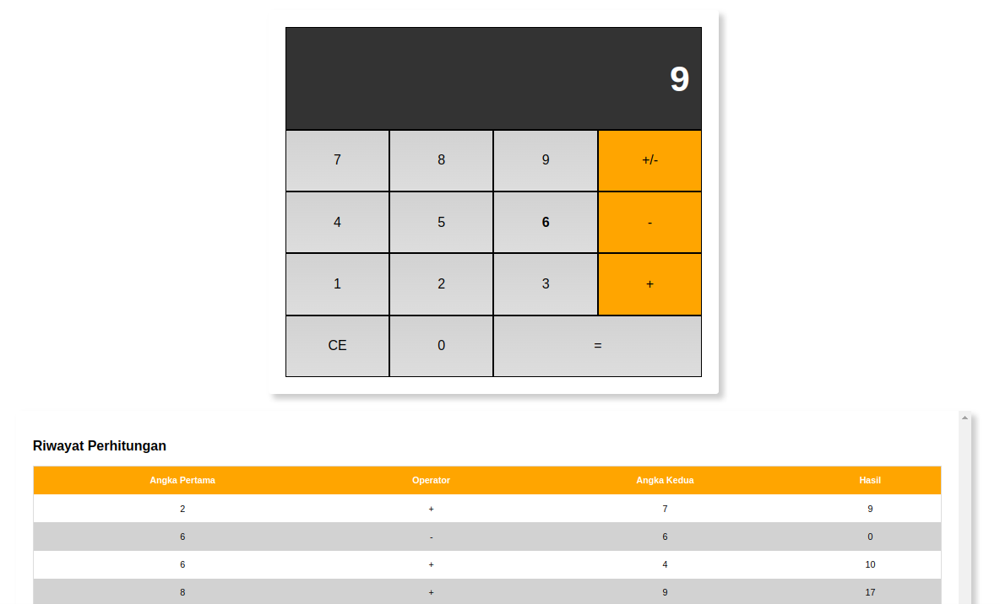

  # Learning to code with [IDCamp](https://idcamp.ioh.co.id/) x [Dicoding](https://www.dicoding.com/learningpaths/22)

First Step to become Front-End Web Developer: Belajar Dasar Pemrograman Web (55 hours).
This step contain two lessons:
1. Make a profile page of city [source](https://github.com/ayidsudirman/dicoding/tree/1.1-profil-page), and
2. Web Calculator

### Screen shot
2. Make a web calculator with session storage history
